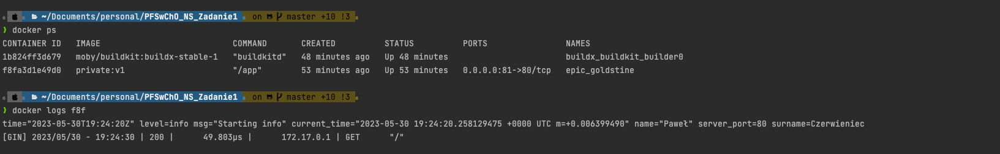
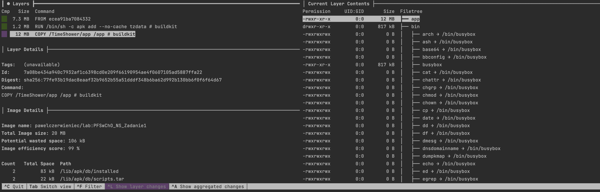

# Zadanie 1

## 3.a
`docker buildx create --name builder`

`docker buildx inspect --bootstrap`

> `-t docker.io/pawelczerwieniec/lab:PFSwChO_NS_Zadanie1` wsakuje nazwę,tag oraz miesjce docelowe obrazu obrazu

> `--platform linux/arm64/v8,linux/arm/v7,linux/amd64` powduje, że budujemy obraz na wybrane platformy 


`docker buildx build -t docker.io/pawelczerwieniec/lab:PFSwChO_NS_Zadanie1 --platform linux/arm64/v8,linux/arm/v7,linux/amd64 --cache-to type=inline --cache-from type=inline --push .`

## 3.b
> Uruchamiamy kontener i sprawiamy, że jest dostępny na porcie 3456

`docker run -d -p 3456:3456 --name lab1 pawelczerwieniec/lab:PFSwChO_NS_Zadanie1`


## 3.c

> docker ps służy do znalezienia id kontenera
 
`docker ps`

```
CONTAINER ID   IMAGE                           COMMAND       CREATED          STATUS          PORTS                NAMES
1b824ff3d679   moby/buildkit:buildx-stable-1   "buildkitd"   48 minutes ago   Up 48 minutes                        buildx_buildkit_builder0
f8fa3d1e49d0   private:v1                      "/app"        53 minutes ago   Up 53 minutes   0.0.0.0:81->80/tcp   epic_goldstine
```

`docker logs f8f`
```
time="2023-05-30T19:24:20Z" level=info msg="Starting info" current_time="2023-05-30 19:24:20.258129475 +0000 UTC m=+0.006399490" name="Paweł" server_port=3456 surname=Czerwieniec
[GIN] 2023/05/30 - 19:24:30 | 200 |      49.803µs |      172.17.0.1 | GET      "/"
```


## 3.d

> Obraz zawiera jedynie trzy warstwy

`dive pawelczerwieniec/lab:PFSwChO_NS_Zadanie1`
