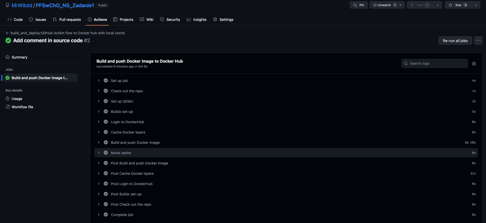
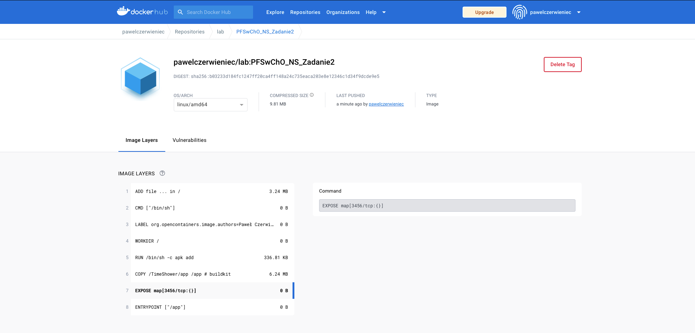

# Zadanie 2

---

### Podpunkt 1.

> Wykorzystując opracowaną aplikację (kod + Dockerfile) z zadania nr1 należy:
a. zbudować, uruchomić i potwierdzić poprawność działania łańcucha Github Actions,
który zbuduje obrazy kontenera z tą aplikacją na architektury: linux/arm64/v8 oraz
linux/amd64 wykorzystując QEMU

Plik odpowiedzialny za proces budowy obrazu znajduje się [tutaj](.github/workflows/build_image.yml)

Proces jest aktywowany automatycznie za każdym razem gdy zmieni się kod aplikacji na głównej gałęzi.
```yaml
  push:
    branches:
      - 'master'
    paths:
      - src/**
      - Dockerfile
```



Proces budowanie automatycznie "wypycha" obraz do zdalnego repozytorium pod tagiem `pawelczerwieniec/lab:PFSwChO_NS_Zadanie2`

