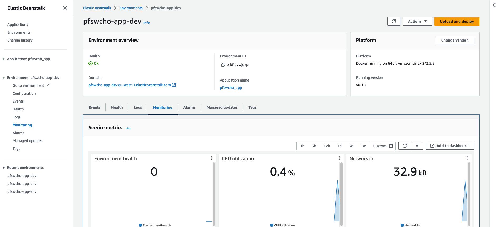

# Zadanie dodatkowe 2.

---

### Podpunkt 1.

> Bazując na przykładzie z instrukcji do laboratorium nr 4 należy wdrożyć aplikację z zadania nr 1
w środowisku AWS, usługa Elastic Beanstalk. Wdrożenie ma bazować na łańcuchu Github Actions.
Łańcuch ma by uruchomiony a poprawność jego działania potwierdzona.

URL: http://pfswcho-app-dev.eu-west-1.elasticbeanstalk.com

Cały proces uruchomienia apliakcji jako środowisko elastic beanstalk znajduje się [tutaj](.github/workflows/deploy_image.yml.
Został stworzony osobny workflow do tego celu.

W cały procesie wykorzystano mechanizm tag'owania commit'ów oraz reagowanie na taką sytuację.

```yaml
on:
  workflow_dispatch:
  push:
    tags:
      - 'v[0-9]+.[0-9]+.[0-9]+'
```

Tego typu rozwiązanie pozwala na ciągły rozwój aplikacji lecz wdrożenie występuje tylko gdy wszystko zostanie sprawdzone,
oraz nazywana jest odpowiednią wersją.


Wykorzystanie narzędzia `get-tag` pozwala na nazwanie wersji w elastic beanstalk w ten sam sposób jak nazywa się tag.
```yaml
  - uses: olegtarasov/get-tag@v2.1.2
    id: tagName
...
  version_label: ${{ steps.tagName.outputs.tag }}
```



